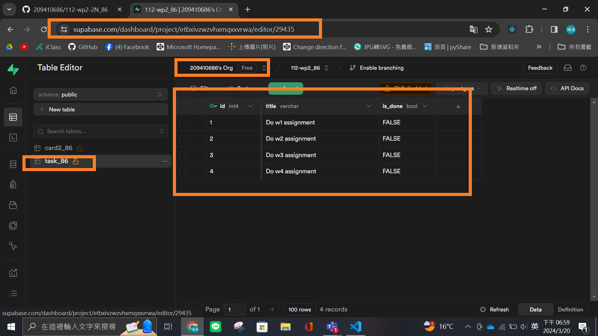
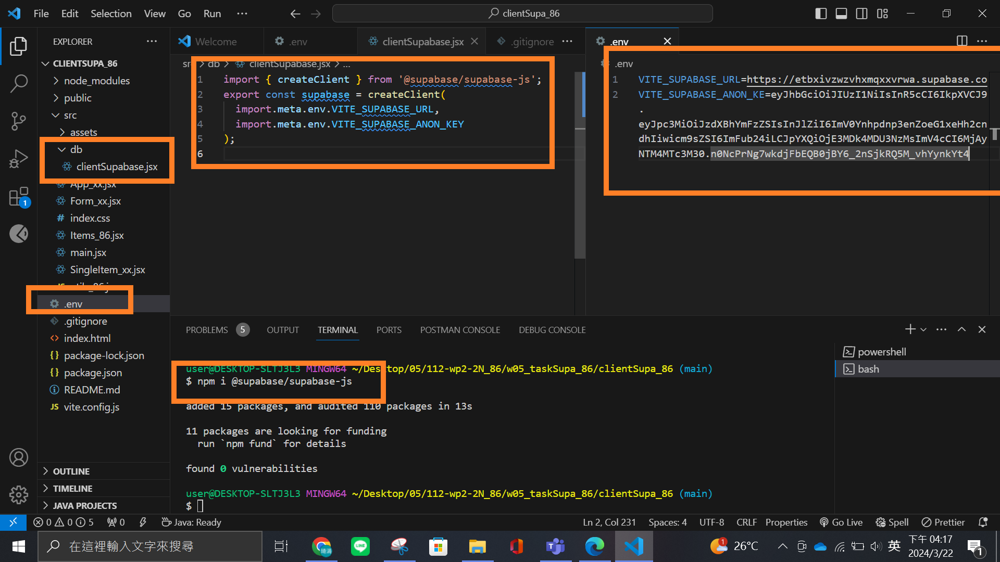
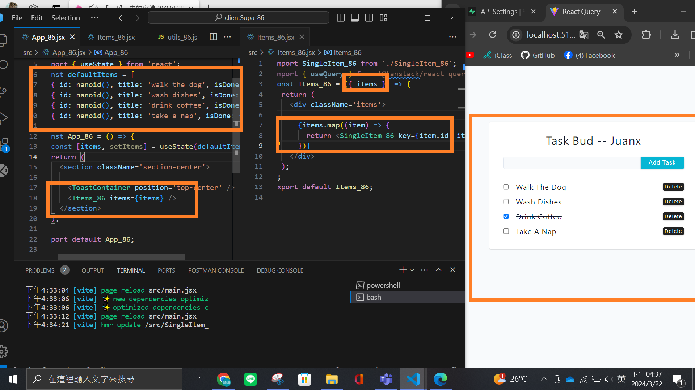
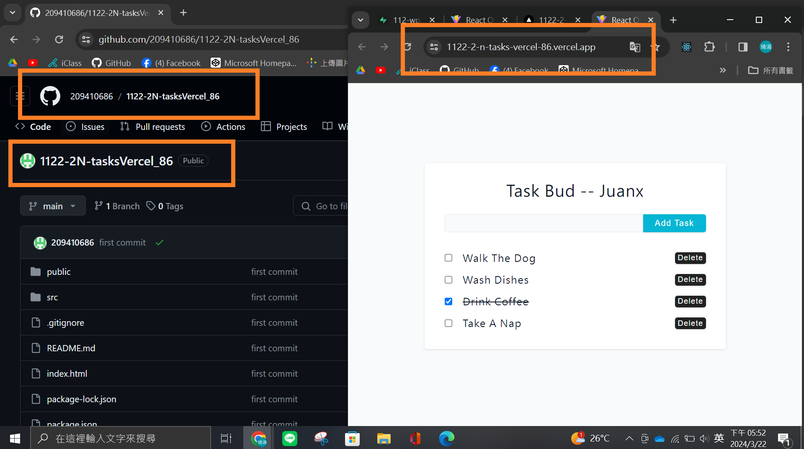
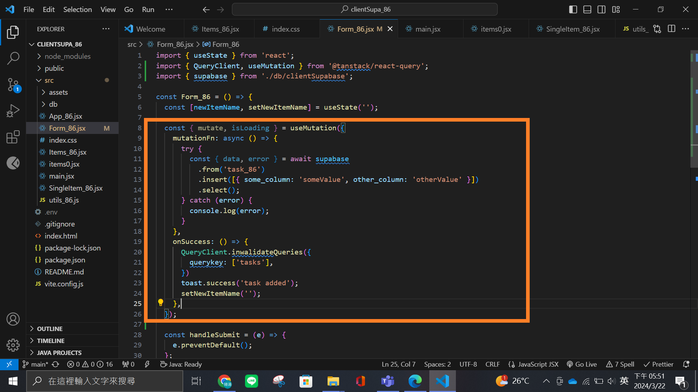

### W5-P1: Create task_xx table in Supabase with 4 data using SQL

### W5-P2: Use React Query to get tasks data from Supabase

## W5-P3: Deploy W5-P2 to Vercel

### W5-P4: Create new Task, deploy W5-P3 to Vercel

#### => local

