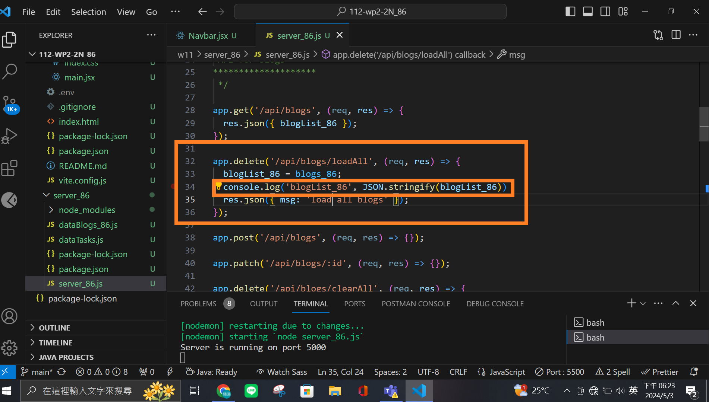

### W11-P1: Make mobileBtn work correctly

### W11-P2: Use Postman to test GET /api/blogs, and DELETE /api/blogs/:id

### W11-P3: Use Postman to test DELETE /api/blogs/clearAll, and POST /api/blogs/loadAll

#### => test DELETE /api/blogs/clearAll

#### => test POST /api/blogs/loadAll

### W11-P4: Git logs of W11

