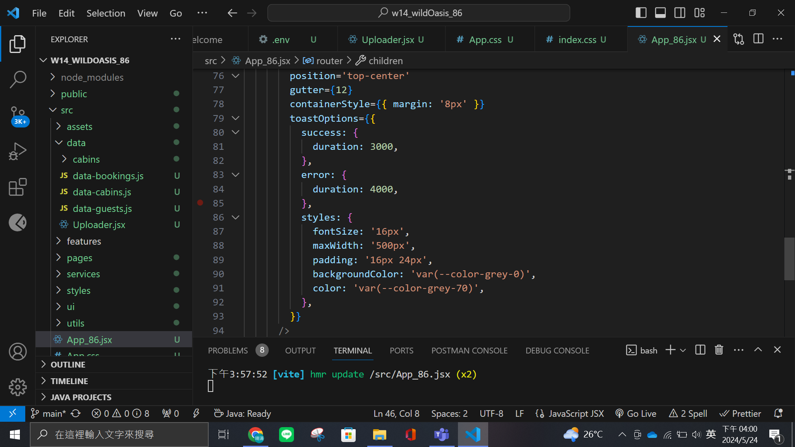
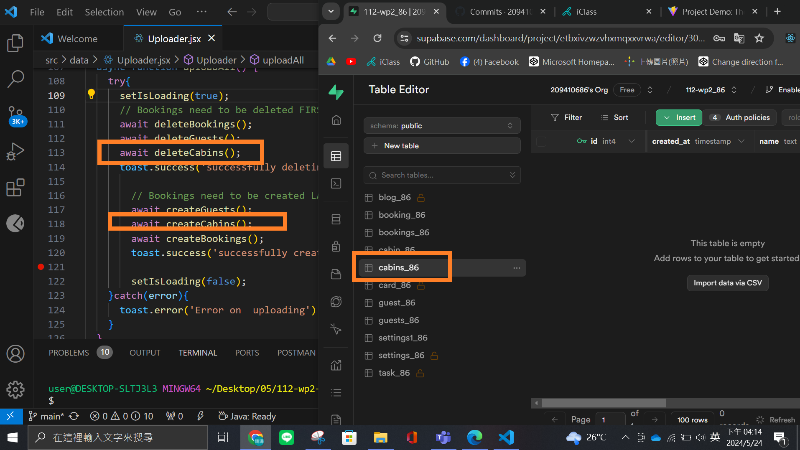
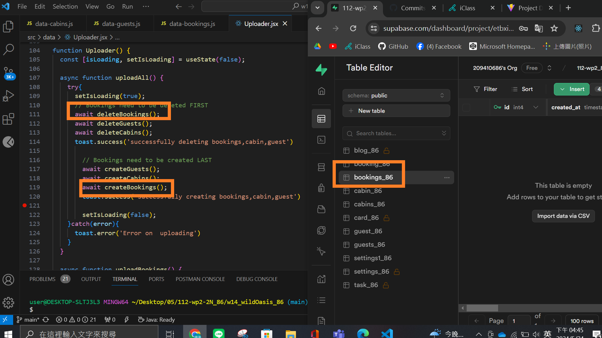
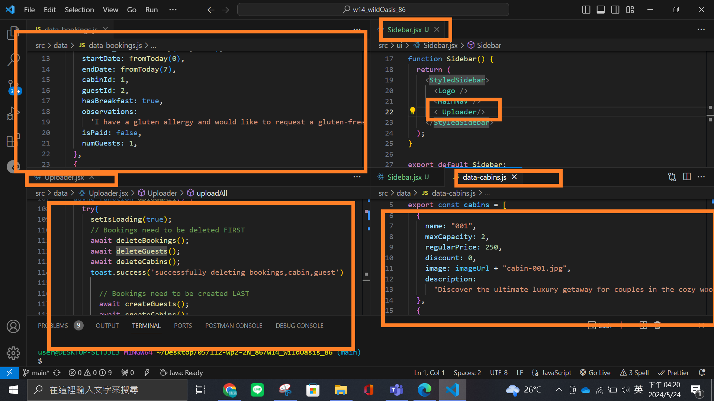

### W14-P1: Use sql to create schemas of cabins_xx, guests_xx, bookings_xx, settings_xx, and use Uploader to upload all data

### W14-P2: Make jonas code work, and show cabins and bookings info

