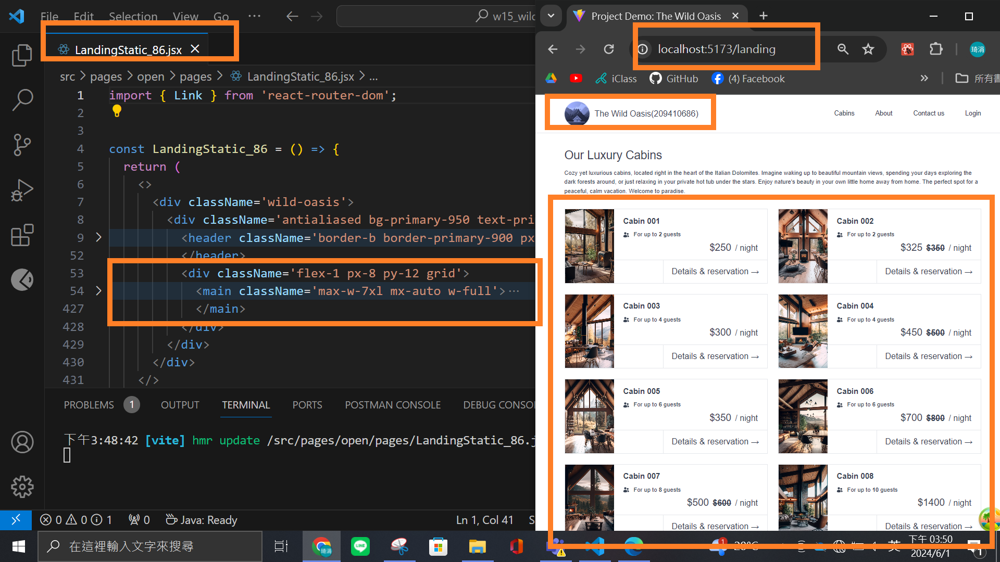
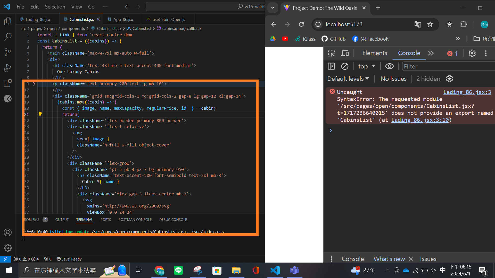

### W15-P1: Show static page <LandingStatic_xx /> using route /landing

### W15-P2: For landing page, get 8 cabins data from Supabase

### W15-P3: Implement login using LoginForm, useLogin, login (apiAuth.jsx), navigate to /dashboard when successful

### => login in with email (has your id), password

### W15-P4: Git logs of W15

