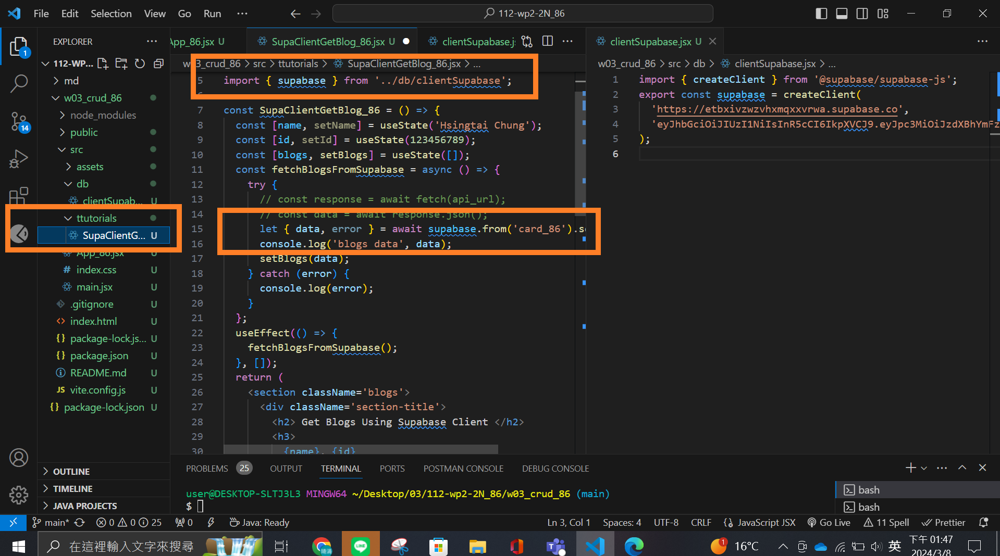
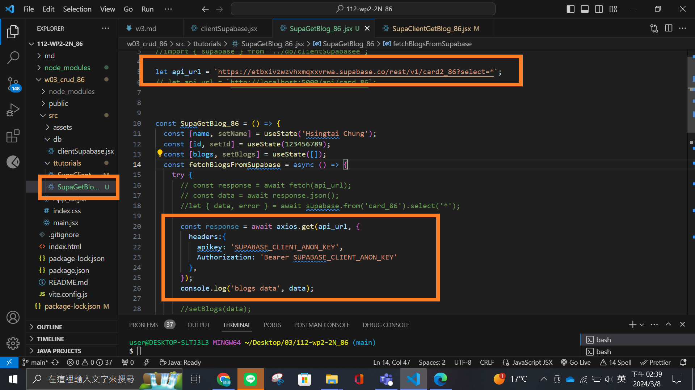
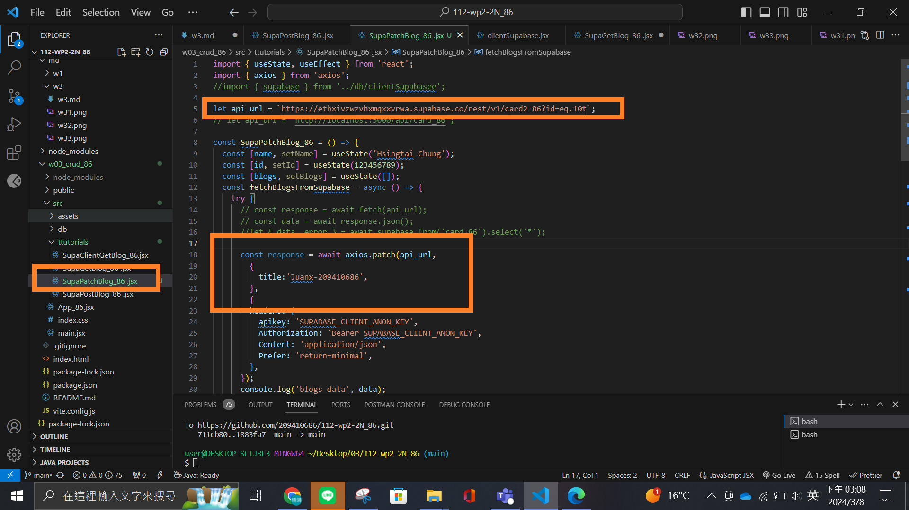
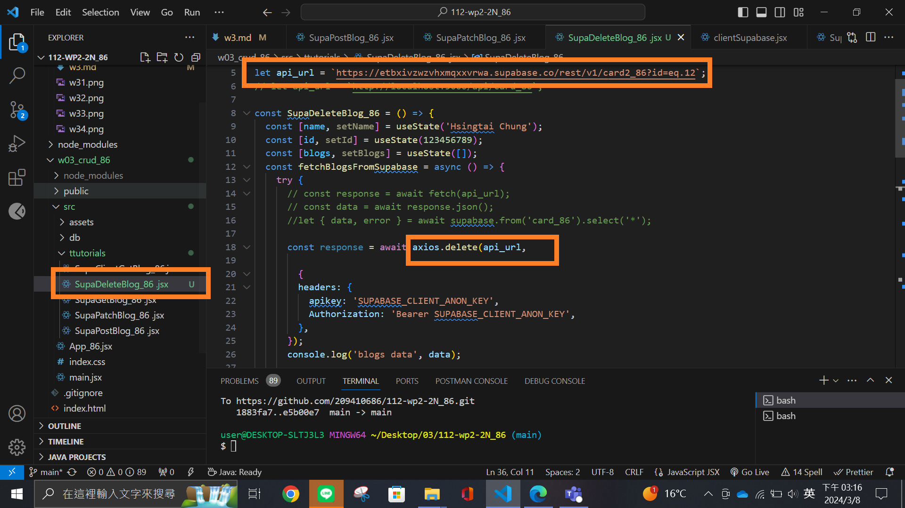

### W3-P1: Use SupaClientGetBlog_xx.jsx (supabase client) to get card_xx data



### W3-P2: Use SupaGetBlog_xx.jsx to get card_xx data



### W3-P3: Use SupaPostBlog_xx.jsx to add blog data


Video: ### W3-P4: Use SupaPatchBlog_xx.jsx to modify blog data



### W3-P5: Use SupaDeleteBlog_xx.jsx to delete blog data



### W3-P6: Git logs of W3

```
git log --pretty=format:"%h%x09%an%x09%ad%x09%s" --after=""
```
